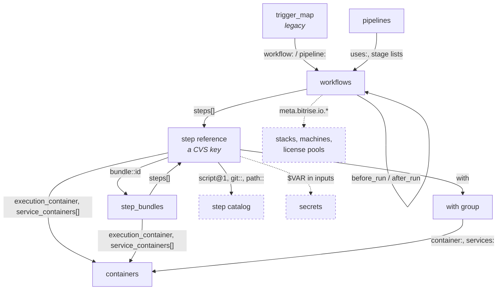

# Domain

What the code is about: the words, the entities, and which invariants anything actually enforces.
Mechanisms are in [flows.md](flows.md), reasoning in [decisions.md](decisions.md).

Where a doc and the code disagree, the code wins and the doc is a bug.

## Glossary

The YAML format is documented in three places, none of them complete, and knowing which to open
saves an afternoon:

| Source | Good for | Stops at |
|---|---|---|
| [Configuration YAML reference][ref] | All sixteen top-level keys, both trigger models, containers, step bundles, `include`, `tools`. The current format | Legacy models: no stages, no `with` groups |
| [Format spec][spec] in the CLI repo | Step and env fields in depth — `is_always_run`, `is_skippable`, `run_if`, `toolkit`, and env metadata like `is_expand` and `skip_if_empty` | Predates pipelines, containers, step bundles, `include` and `tools`, so its silence is age, not invalidity |
| [Glossary][gl] | Product vocabulary: project, workspace, stack, secret | Anything editor-internal |

Read those for the format. Read this for what the *editor* adds, guarantees, or fails to
guarantee.

**Three of these are legacy**: stages, utility workflows and `trigger_map`. Stages and utility
workflows are absent from the public docs entirely, and that absence is the point — they are not
offered to new users. The editor still has to read, render and cascade over them, because configs
in the wild contain them, so this table is their only definition. Do not build new surface on any
of the three; where a current model exists beside a legacy one, see
[the two-model sections](#two-models-twice).

`with` groups are a fourth legacy shape, but effectively unused in real configs. They earn a line
below only because `StepLike` unions them in, so anything touching step handling meets
`isWithGroup` whether configs use it or not.

[ref]: https://docs.bitrise.io/en/bitrise-ci/references/configuration-yaml-reference
[gl]: https://docs.bitrise.io/en/bitrise-ci/references/glossary#workflow-editor
[spec]: https://github.com/bitrise-io/bitrise/blob/master/_docs/bitrise-yml-format-spec.md

| Term | Means |
|---|---|
| **active document** | The file `ymlDocument` points at. The whole config when single-file, the selected tab when modular. |
| **CVS** | A step's reference, packing library, id and version into one string. [Table](#reference-tables) |
| **entity index** | Precedence-ordered map of which file defines which entity. The only cross-file-aware structure. |
| **FileSlice** | One file's state in modular mode: path, document, saved document, editable flag. |
| **generator workflow** | A workflow that produces other workflows at runtime; the canvas draws placeholders for them. |
| **graph pipeline** | Has a `workflows` map and arbitrary `depends_on` edges. |
| **legacy trigger** | An entry in top-level `trigger_map`. Flat, prefixed keys, first-match-wins. |
| **merged tab** | Read-only preview of a modular config flattened. No slice backs it, so writes no-op. |
| **nodeId** | Backend-owned opaque key for a file. `path` is not unique, so never key by it. |
| **staged pipeline** | *Legacy.* Has a `stages` list: an ordered sequence of full barriers. |
| **step bundle** | Named, reusable step sequence with its own inputs. Referenced as `bundle::<id>`. |
| **target-based trigger** | Declared on the workflow it fires, nested under its type. All matches fire. |
| **utility workflow** | *Legacy.* Id starts with `_`, marking it not directly runnable. Convention only; the YAML has no concept of it. |
| **`with` group** | *Legacy, effectively unused.* A step-list wrapper running its steps in a container. You meet it as a `StepLike` variant, not in the wild. |
| **`yml` / `ymlDocument`** | `ymlDocument` is the writable AST, `yml` a read-only object derived from it. |

## What the editor edits

One artifact: **`bitrise.yml`**, the CI config of a single Bitrise project. Modular configs make
that a tree of files merged into one.

The domain splits in two, and the split matters more than any single entity:

| | In the document | Outside it |
|---|---|---|
| **Entities** | workflows, pipelines, step bundles, containers, trigger map, app envs, tools, `meta` | secrets, stacks and machines, license pools, the step catalog |
| **Read via** | `BitriseYmlStore` selectors | React Query hooks |
| **Written via** | services calling `updateBitriseYmlDocument` | their own endpoints, immediately |
| **Saved** | all at once, one file, with a concurrency token | per operation |
| **Undo** | discard changes, re-parsing the saved document | none |

> **Rule.** The config names the outside-the-document things by bare string
> (`meta.bitrise.io.stack`, `$MY_SECRET` in an input) and **nothing resolves those references**. A
> `bitrise.yml` naming a secret that does not exist is not an error state anywhere in the editor.

The one exception is stacks: `prepareStackAndMachineSelectionData` flags an id missing from the
fetched catalog as `isInvalidStack` and renders it as an explicit invalid option. Nothing does the
equivalent for secrets, containers or license pools.

## The entity map

Every arrow is a plain string in the YAML with no referential integrity behind it.



Every edge label is the YAML key that carries the reference, which is what you grep when you
need to find or clean up every pointer to something. The map is the YAML schema, not the editor's
coverage: a `with` group's `services:` is a container reference no code path reads or writes,
though with groups are rare enough that it has probably never bitten anyone. Dashed nodes live outside the document. A
`step_bundles` entry may reference another one, which is legal, recursive and
[unguarded](decisions.md#open-defects).

## Entities

| Entity | Identity | Lives at | Service |
|---|---|---|---|
| **Workflow** | map key | `workflows.<id>` | `WorkflowService` |
| **Pipeline** | map key | `pipelines.<id>` | `PipelineService` |
| **Step bundle** | map key | `step_bundles.<id>` | `StepBundleService` |
| **Step** | **positional**, its index | `…steps[i]` | `StepService`, `StepVariableService` |
| **Container** | map key | `containers.<id>` | `ContainerService` |
| **Trigger** (target-based) | position in the list | `workflows.<id>.triggers.<type>[]` | `TriggerService` |
| **Trigger** (legacy) | position in the list | `trigger_map[]` | `TriggerService` |
| **Env var** | `key` plus its source | `app.envs[]`, `workflows.<id>.envs[]` | `EnvVarService` |
| **Stage** | map key, legacy | `stages.<id>` | none |
| **Secret** | `key` | *not in the document.* Website mode: the monolith. CLI mode: `.bitrise.secrets.yml`, overridable with `BITRISE_SECRETS` | `SecretService` |
| **Stack / machine** | catalog id | `meta.bitrise.io.*` | `StackAndMachineService` |
| **File node** | opaque `nodeId` | the tree, not the YAML | `TreeService`, `FileTreeService` |

> **Rule.** **Position is identity for steps.** A step has no id; it is the *i*-th entry of a
> `steps[]` array, and its CVS key names a catalog coordinate rather than this occurrence. Two
> `script@1` steps in one workflow are indistinguishable except by index, so every step operation
> takes an index and any concurrent reorder invalidates one you were holding.

Nothing references a step, a trigger or a stage. Everything else is referenced by name.

## Naming

```
/^[A-Za-z0-9-_.]+$/     workflows · pipelines · containers · step bundles
```

Four services define that regex independently and four `validateName` functions repeat the same
three checks: non-empty, matches, unique. Validators return `string | boolean` — the error
message on failure, never `false`.

**Namespaces are per-collection**, so a workflow and a pipeline may share a name. Uniqueness is
only ever checked against the list the caller passes in, which in modular mode is the active
file's list.

**Renaming means rewriting every reference.** There is no indirection layer, which is exactly why
it is a service function and not a store field. See
[flows.md](flows.md#6-renaming-or-deleting-a-workflow) for the passes it takes.

## What is actually enforced

The most useful table here. Structural invariants inside one document hold. Every reference that
crosses a boundary is a bare string nothing validates.

| Invariant | Where | Strength |
|---|---|---|
| Entity exists before mutation | `getXOrThrowError` | **Enforced**, throws |
| Name charset and uniqueness | `validateName` | **At the form**, not the service |
| A reference target exists | `assertWorkflowReferenceable` | Workflow chains only |
| Deleting removes inbound edges | `deleteWorkflow`'s passes | Within the active document |
| No cycles in `before_run`/`after_run` | `getChainableWorkflows` | **Assumed.** The filter is built from the unguarded walk, so it throws on an already-cyclic config |
| No cycles in bundle nesting | `StepBundleList` filter | **Assumed**, same shape |
| Referenced container exists | nothing | **Not checked** |
| Referenced secret exists | nothing | **Not checked** |
| Referenced stack exists | `isInvalidStack` | Flagged, not blocked |
| Untouched YAML stays byte-identical | `YmlUtils` and the style vote | **Best-effort.** A mixed-style file loses its minority style |

## Two models, twice

Triggers and pipelines each carry a legacy and a current model, handled in opposite ways.

| | Triggers | Pipelines |
|---|---|---|
| Old | `trigger_map[]`, flat, **first-match-wins** | `stages: []`, ordered full barriers |
| New | `workflows.<id>.triggers.<type>[]`, all fire | `workflows: {}`, a `depends_on` DAG |
| Detection | which key exists | `isGraph = Boolean(pipeline.workflows)`, structural |
| Unification | one generic `Trigger<TConditionType>`, so one component set renders both | none, separate paths |
| Conversion | only when there is at most one legacy trigger per type | always, one-way |

Both are lossless in data and lossy in intent, which is
[why neither converts back](decisions.md#why-conversions-are-one-way).

## Modular mode narrows every rule

`ymlDocument` binds to the active tab's file, not the whole config
([how](flows.md#3-one-file-or-many), [why](decisions.md#why-cross-file-operations-are-incomplete)).
Every rule above that needs the whole config is therefore incomplete:

| Rule | Single-file | Modular |
|---|---|---|
| Name uniqueness | Global | Active file only, so two files may define the same workflow |
| Delete cascade | Every pass lands | References in other files are left dangling |
| Rename | Rewrites every reference | Other files keep the old name |
| "Used by N workflows" | Accurate | **Under**counts, so it reassures |
| Deleting an entity defined elsewhere | n/a | Throws, failing loudly rather than half-applying |

`EntityIndexService` is the one cross-file-aware piece. Among services only
`assertWorkflowReferenceable` reads it, which is why the write paths stay narrowed — but read paths
increasingly do not: the store, `useTree`, `useJumpToDefinition`, `useTargetBasedTriggers` and the
jump-to-definition UI all consult it. Cross-file *awareness* is spreading; cross-file *writing* is
still one file at a time.

## Reference tables

Consult, don't read.

<details>
<summary><b>Step references (CVS)</b> — <code>parseStepCVS</code> is ordered dispatch, so reordering the branches changes behaviour</summary>

| Reference | Library | Id | Version |
|---|---|---|---|
| `script@1` / `script` | `bitrise`, from `default_step_lib_source` | `script` | `1` / none |
| `bundle::my-bundle` | `bundle` | `my-bundle` | none |
| `with` | `with` | `with` | none |
| `path::./steps/local@x` | `path` | `./steps/local` | none, `@x` is **discarded** |
| `git::https://…git@next` | `git` | the URL | `next` |
| `https://…bitrise-steplib.git::script@1` | `bitrise` | `script` | `1` |
| `https://custom…::baz@next` | `custom` | `baz` | `next` |

Only `bitrise`, `custom` and `git` carry a version. The bare form is context-dependent, resolving
against `default_step_lib_source`, which is why every predicate takes a `defaultStepLibrary`.

</details>

<details>
<summary><b>Step versions</b> — an empty version is a policy, not an absence</summary>

| In yml | Normalized | Resolves to | UI calls it |
|---|---|---|---|
| empty | empty | `3.0.1` | Always latest |
| `2` | `2.x.x` | `2.2.0` | Minor and patch updates |
| `2.1` | `2.1.x` | `2.1.9` | Patch updates only |
| `2.1.6` | `2.1.6` | `2.1.6` | Version in bitrise.yml |

> **Trap.** An empty version means *always latest*. Removing a pin changes what runs; it is not
> tidying.

</details>

<details>
<summary><b>Trigger conditions</b> — the two models differ only in vocabulary</summary>

| Concept | Legacy (`trigger_map`) | Target-based (`triggers:`) |
|---|---|---|
| Push branch | `push_branch` | `branch` |
| PR target | `pull_request_target_branch` | `target_branch` |
| PR source | `pull_request_source_branch` | `source_branch` |
| PR label | `pull_request_label` | `label` |
| PR comment | `pull_request_comment` | `comment` |
| Tag | `tag` | `name` |
| Commit message | `commit_message` | `commit_message` |
| Changed files | `changed_files` | `changed_files` |

Legacy keys are flat and prefixed because one object holds every condition kind. Target-based keys
nest under their trigger type, so prefixes would be redundant.
`LEGACY_TO_TARGET_BASED_CONDITION_MAP` is typed `Record<LegacyConditionType, …>`, so the compiler
enforces totality. No reverse map exists.

</details>

<details>
<summary><b>Tool versions</b> — a <code>tools:</code> value is a small language</summary>

| In the YAML | Means |
|---|---|
| `latest` | Newest published version |
| `installed` | Newest version already on the stack |
| `20:latest` | Newest published inside the `20` line |
| `20:installed` | Newest installed inside the `20` line |
| `unset` | Do not manage this tool here. Workflow scope only; `setTool` throws at root |
| `20.1.2` | Exactly that |
| `20:banana` | Exact and verbatim. An unrecognised suffix is not an error |

Keyword matching is case-insensitive, the prefix keeps its case, and the colon split uses
`indexOf(':') > 0`, so a leading colon never makes a prefix.

</details>

<details>
<summary><b>The three value layers</b> — used by steps, bundle instances and containers</summary>

`defaultValues` come from the catalog, `userValues` from `bitrise.yml`, `mergedValues` from both.

> **Trap.** Only `userValues` reaches the document. A field can look set in the UI while the YAML
> holds nothing, and writing a value equal to the default still adds a line.

A step bundle is a function: the definition declares `inputs` with defaults, a reference supplies
arguments. The service keeps the sides apart down to the method names, `addStepBundleInput` versus
`updateStepBundleInputInstanceValue`. Containers work the same way, one definition and many
references, each with its own `recreate` flag.

</details>

---

*Verified against the repo on 2026-08-20. Known gaps and defects are in
[decisions.md](decisions.md#open-defects).*
