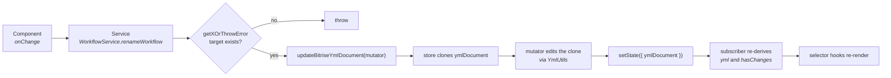
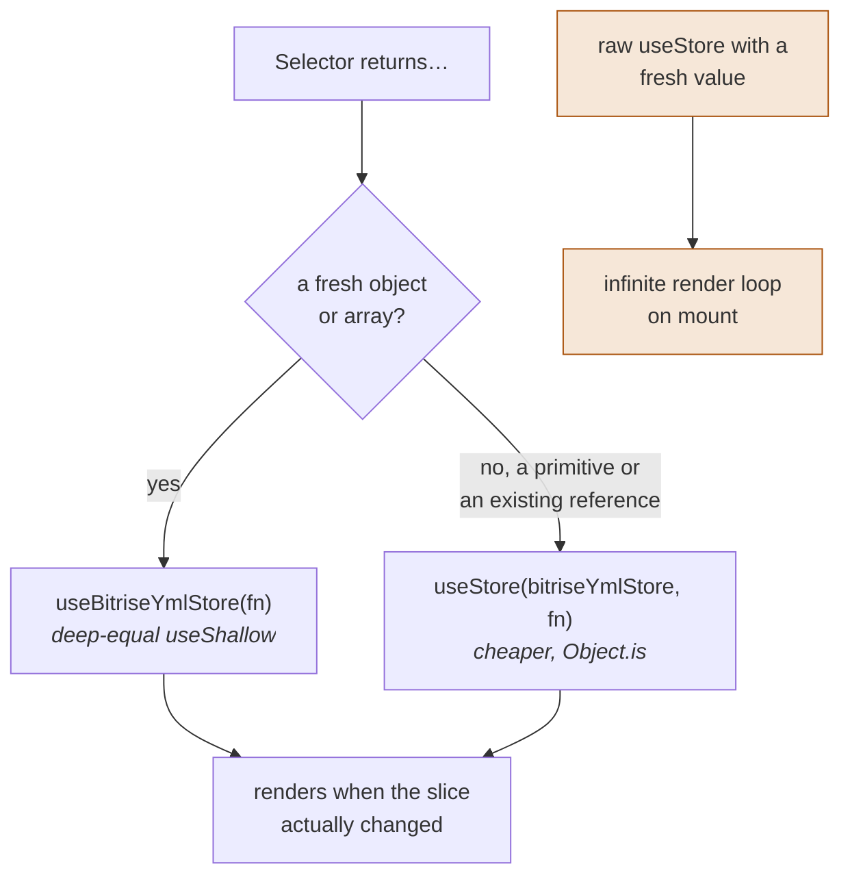
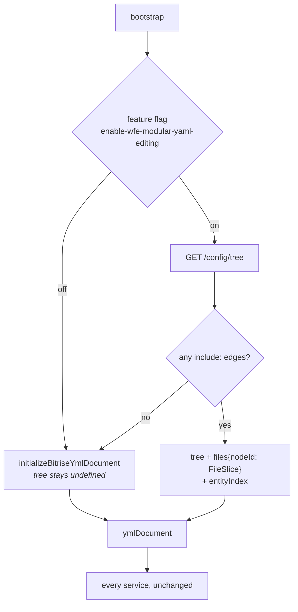
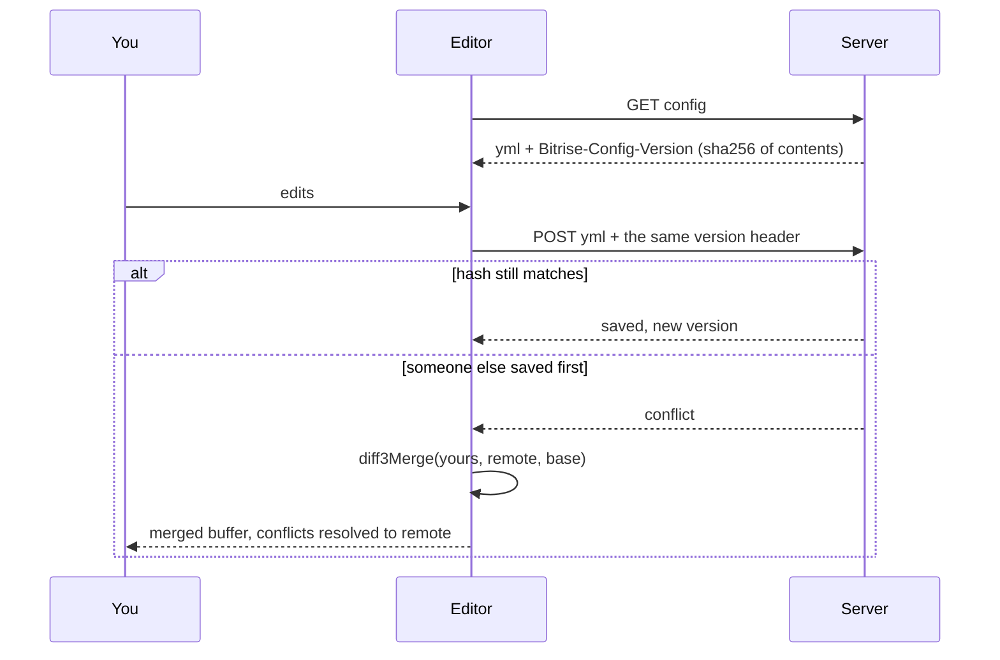
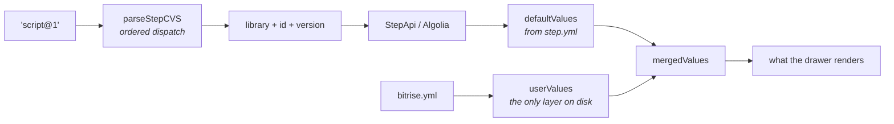
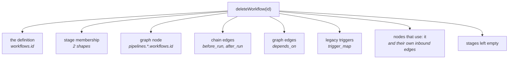
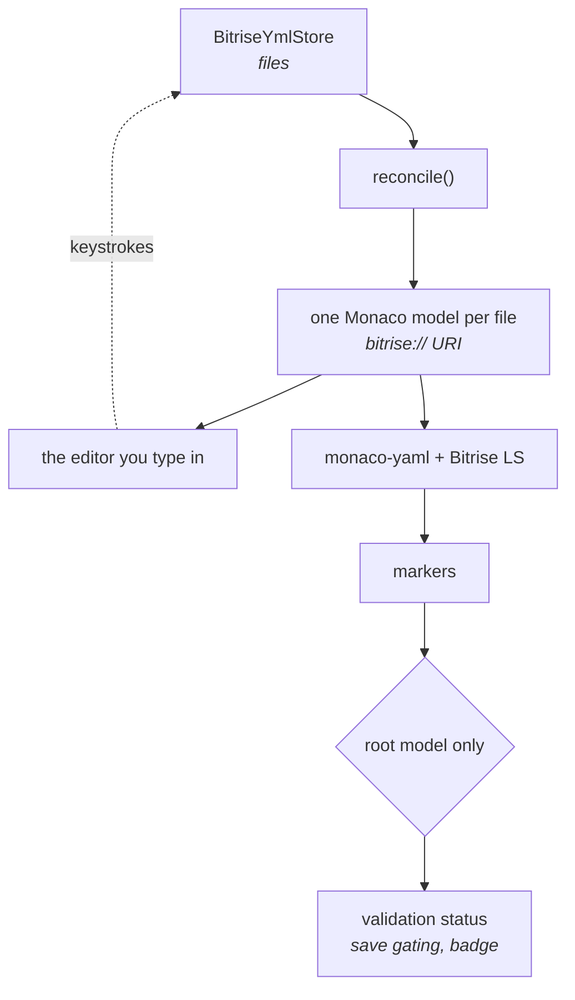

# Flows

Seven paths through the app, chosen by what the codebase actually touches: everything that edits
the config funnels through one mutation entry point, modular mode cuts across all of it, and
`WorkflowService` and `StepService` are the two other services build on.

Read [domain.md](domain.md) first if the words `workflow`, `pipeline`, `step bundle` and
`CVS` don't yet mean specific things to you.

| Flow | Start reading at |
|---|---|
| [1. Editing the config](#1-editing-the-config) | `core/stores/BitriseYmlStore.ts` |
| [2. Reading the config](#2-reading-the-config) | `hooks/useBitriseYmlStore.ts` |
| [3. One file or many](#3-one-file-or-many) | `core/models/Tree.ts` |
| [4. Saving](#4-saving) | `hooks/useSaveCiConfig.ts` |
| [5. Adding a step](#5-adding-a-step) | `core/services/StepService.ts` |
| [6. Renaming or deleting a workflow](#6-renaming-or-deleting-a-workflow) | `core/services/WorkflowService.ts` |
| [7. The YAML tab](#7-the-yaml-tab) | `hooks/useYmlLanguageServices.ts` |

---

## 1. Editing the config

Every typed UI in the app funnels into one function. Learn this and most of the codebase stops
being surprising.

The store keeps the config twice. `ymlDocument` is a `yaml` AST that remembers comments, key
order and formatting, and it is the writable one. `yml` is a plain object derived from it, and it
is read-only. Reads go through `yml`, writes go through `ymlDocument`.

The clone is not defensive habit; it is what makes the caches and the subscriber work at all.
[Why](decisions.md#why-the-store-clones-before-every-mutation).

**Two entry points into the active document.** `updateBitriseYmlDocument(mutator)` is for
structured edits and only services call it; a lint rule enforces that in `.tsx` files, and a `.ts`
caller slips through. `updateBitriseYmlDocumentByString(text)` replaces the whole document from raw
text, and the UI calls it legitimately from the YAML editor, the diff dialog and the AI drawer.
Modular mode adds `updateFileDocument` and `updateFileDocumentByString`, which take a `nodeId` and
write to a named file
([why that matters](decisions.md#why-cross-file-operations-are-incomplete)).

Why it matters: [YAML must survive a round-trip](decisions.md#why-the-yaml-is-an-ast-not-an-object).

---

## 2. Reading the config

`useBitriseYmlStore` wraps every selector in `@/hooks/useShallow`, which despite the name is deep
equality via `dequal`, not Zustand's one-level version. That is what makes inline object-building
selectors legal at all.

Get this wrong and the page hangs rather than merely re-rendering too much, because
`useSyncExternalStore` compares snapshots by identity and a fresh object is never identical. A
lint rule catches the common shapes; a fresh value built inside a block body is still on you.

Why it matters: [the wrapper is a precondition, not a tuning knob](decisions.md#why-useshallow-is-deep).

---

## 3. One file or many

A config can be one `bitrise.yml` or a tree of files linked by `include:`. Most of the store's
surface beyond the single mutation entry point exists to serve the second case.

> **The trick.** `ymlDocument` is not *the config*. It is a binding to the active tab's file.
> Selecting a tab re-points it, and every service keeps working without knowing files exist.
> That indirection is why multi-file editing shipped without modifying a single pre-existing
> domain service.

Mode is decided by `state.tree !== undefined`, never by the flag. `files` holds the contents,
`tree` is the structural skeleton, and `entityIndex` records which file defines which entity in
precedence order, highest first. `nodeId` is backend-owned and opaque; `path` is not unique, so
never key by it.

**The flag defaults to off**, and the monolith resolves it per account into
`globalProps.featureFlags.account`. So modular mode is not the common path, and every hazard below
that begins "in modular mode" applies to the accounts that have it switched on rather than to
everyone. That is the bit that decides how urgent a cross-file bug is.

A node's `editable` flag is computed by the backend, not chosen in the UI: a file is editable only
when it lives in the working repo on the current branch. An `include:` that names another repo,
branch, tag or commit comes back read-only, which is what makes a full cross-file cascade a policy
question rather than a coding one.

Why it matters, and what it costs:
[scope narrowed, guards not](decisions.md#why-cross-file-operations-are-incomplete).

---

## 4. Saving

There is no revision counter. The server SHA-256s the file's contents and hands back the digest;
a save replays it and is rejected when the hash has moved. Content-addressed, stateless, and it
survives a server restart. The modular tree does the same one level down with a per-node
`commitSha`.

> **Trap.** The merge writes **no conflict markers**. Every conflicting region resolves to the
> remote side, your text is dropped from the buffer, and a red decoration is the only record.
> Dismiss the dialog without editing and your work is gone, with no prompt and no undo.

Why it works that way: [markers would break the YAML](decisions.md#why-conflicts-resolve-to-remote).

---

## 5. Adding a step

`parseStepCVS` is ordered dispatch, so specific prefixes match before the bare form and
reordering the branches changes behaviour. Only `userValues` reaches the document, which is why
the UI can show a field the YAML does not contain.

The grammar, the version model and why position is a step's identity are in
[domain.md](domain.md#reference-tables).

---

## 6. Renaming or deleting a workflow

The reference implementation for removing anything, because a workflow is the entity everything
else points at.

One pass per class of inbound edge, and nothing enumerates the classes for you: a new way to
reference a workflow needs a new pass, found by grepping the field name.

Rename covers the same edges but is not a mirror image. It has no equivalent of delete's
empty-stage cleanup, and it rewrites a graph node's `uses:` in place where delete removes the node
and then has to clean up the `depends_on` edges pointing at *it*. Read both before changing
either.

Passes that can empty a collection carry a `keep` argument so the parent survives; see
[conventions.md](conventions.md#services).

> **Trap.** In modular mode every pass reaches only as far as the active file. Other files keep
> the old name or a dangling reference, and "used by N workflows" undercounts, so the guard
> reassures you at exactly the wrong moment.

---

## 7. The YAML tab

Same URI means same model, so the language worker analyses exactly the text you see, and the
whole include tree registers as one workspace, which is what makes cross-file go-to-definition
resolve.

Validation status watches the **root model only**. monaco-yaml registers the whole-config schema
with `fileMatch: ['*']`, so an include fragment with no `format_version` reports an `anyOf` error;
aggregating would flip a perfectly valid config to invalid and bounce you out of the visual
editor.

> **Trap.** In dev website mode the schema layer is skipped entirely for cross-origin reasons, so
> you get no markers and a permanently valid status.

Why it is built this way:
[one model, shared](decisions.md#why-the-editor-shares-models-with-the-worker).
